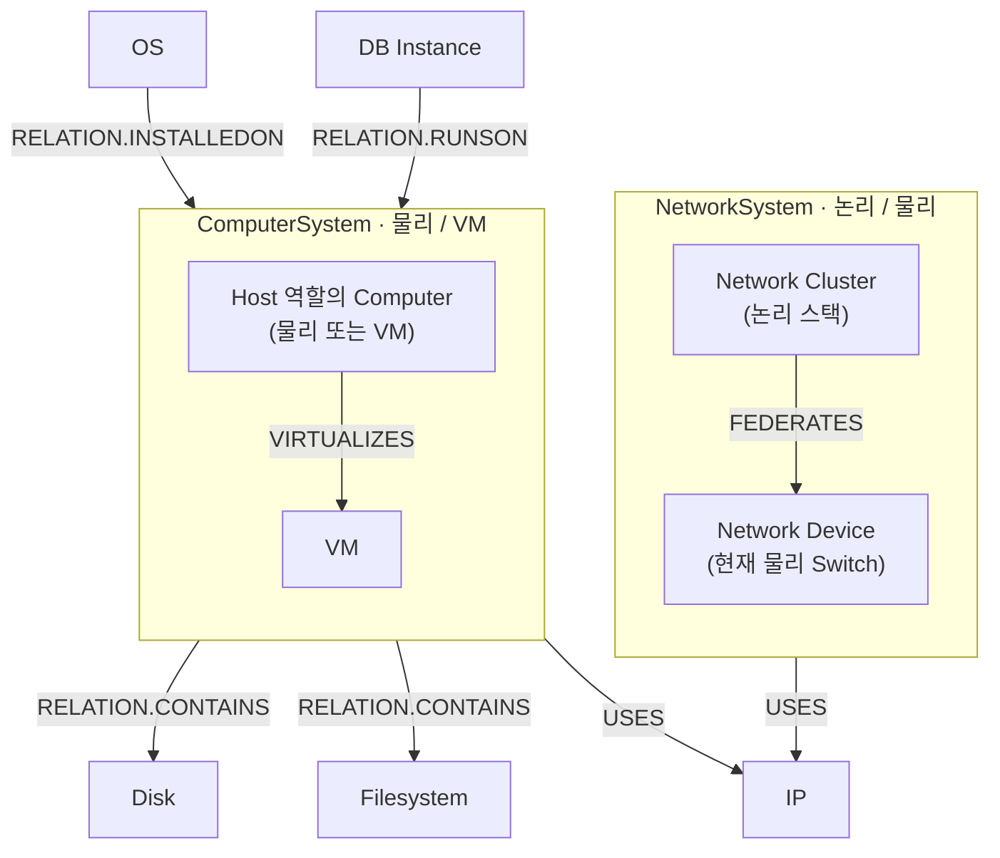

# CI 관계 통합 명세

> 기준: 현재 코드 · 2026-09-21 문서 대조. 운영 DB 재조회·적재는 수행하지 않았다.
> 현재 구현된 **일곱 관계**의 방향·정확한 코드·원천 연결 SQL 정본이다.
> 본체의 [분류·스펙](classstructure.md), 관계 행의 컬럼·MERGE는 [ACTCIRELATION](actcirelation.md)을 따른다.

## 1. 관계도

화살표는 SOURCECI → TARGETCI의 저장 방향이며, 선은 코드가 생성하는 관계 후보를 뜻한다.
실제 저장에는 원천 연결 쌍, 양 끝 ACTCI, 해당 관계 코드와 분류쌍 규칙이 필요하다.
영역으로 연결한 화살표는 그 영역의 조건에 맞는 개별 CI에 적용하며, 영역 전체를 하나의 CI로 저장하지 않는다.



**영역과 역할:** ComputerSystem·NetworkSystem은 설명용 묶음이며 실제 CLASSIFICATIONID가 아니다.
ComputerSystem 영역은 Host·VM 이외의 일반 물리 Computer도 포함한다. Host는 별도 분류가 아니라
물리 Computer 또는 VM이 수행하는 역할이고, VIRTUALIZES의 도착은 VM이다.
NetworkSystem 영역은 논리 Cluster와 물리 장비를 구분한다. 현재 FEDERATES 구현의 물리 대상은
Switch이며 Router까지 지원한다는 뜻이 아니다. 정확한 분류 대응은 3절 표를 따른다.

**IP 연결:** ComputerSystem·NetworkSystem의 USES는 같은 DEVICE_USES_IP 정의를 영역별로 나눈 표현이다.
NetworkSystem 전체에서 후보를 조회하지만 실제 Device–IP 쌍과 저장된 분류쌍 규칙이 있어야 연결된다.
기존 관측에서는 네트워크 관리 IP가 Cluster에 연결됐고 물리 Switch의 직접 IP 쌍은 0건이었다.
당시 Switch→IP 규칙도 미등록으로 기록돼 있으므로, 이 그림을 물리 Switch의 IP 적재·검증 완료로 해석하지 않는다.
관측 근거와 등록 이력은 [관계 설계](../../design/ci/relations.md)를 따른다.

OS는 RUNSON이 아닌 **RELATION.INSTALLEDON**, DB Instance는 **RELATION.RUNSON**을 사용한다.
VIRTUALIZES·USES·FEDERATES에는 RELATION. 접두어를 붙이지 않는다.

## 2. 실행 순서와 연결 키

`ci`: 정의 로딩 → DB Instance → Device → Disk → Filesystem → IP → OS → 아래 일곱 관계.
본체 작업 실패 후에도 관계 단계는 실행된다. 정의 준비 자체가 실패하면 실행하지 않는다.
`ci-relation`은 관계 단계만 실행하며 본체를 생성하지 않는다.

| 순서 | Pipeline 관계 정의 | 원천 연결 정의 | 방향 | RELATIONNUM | ACTCINUM 접두어 출발 → 도착 |
| --- | --- | --- | --- | --- | --- |
| 1 | OS_INSTALLED_ON_COMPUTER | OS_DEVICE | OS → Computer | RELATION.INSTALLEDON | D42:DEVICEOS: → D42:DEVICE: |
| 2 | COMPUTER_CONTAINS_DISK | DEVICE_DISK | Computer → Disk | RELATION.CONTAINS | D42:DEVICE: → D42:PART: |
| 3 | COMPUTER_CONTAINS_FILESYSTEM | DEVICE_FILESYSTEM | Computer → Filesystem | RELATION.CONTAINS | D42:DEVICE: → D42:MOUNTPOINT: |
| 4 | HOST_VIRTUALIZES_VM | HOST_VM | Host → VM | VIRTUALIZES | D42:DEVICE: → D42:DEVICE: |
| 5 | DB_INSTANCE_RUNS_ON_DEVICE | DATABASE_INSTANCE_DEVICE | DB Instance → Computer | RELATION.RUNSON | D42:DATABASEINSTANCE: → D42:DEVICE: |
| 6 | DEVICE_USES_IP | DEVICE_IP | Device → IP | USES | D42:DEVICE: → D42:IPADDRESS: |
| 7 | NETWORK_CLUSTER_FEDERATES_DEVICE | NETWORK_CLUSTER_DEVICE | Network Cluster → 물리 Switch | FEDERATES | D42:DEVICE: → D42:DEVICE: |

각 접두어 뒤에 해당 원천 PK 문자열을 붙인다. 본체·관계 모두 MaximoCiIdentity를 사용한다.
예를 들어 Instance PK=12가 Component를 거쳐 Device PK=34에 연결되면
`D42:DATABASEINSTANCE:12 → D42:DEVICE:34 / RELATION.RUNSON`이 된다.
PK는 예시이며 특정 데이터 값에 의존하는 규칙이 아니다.

## 3. 분류와 수집 조건

| 연결 | 예상 분류쌍 | D42 조인 키 |
| --- | --- | --- |
| OS → Computer | SYS.OPERATINGSYSTEM → SYS.COMPUTERSYSTEM / SYS.VIRTUALCOMPUTERSYSTEM | `o.device_fk = d.device_pk` |
| Computer → Disk | SYS.COMPUTERSYSTEM / SYS.VIRTUALCOMPUTERSYSTEM → DEV.DISKDRIVE | `p.device_fk = d.device_pk; p.partmodel_fk = pm.partmodel_pk` |
| Computer → Filesystem | SYS.COMPUTERSYSTEM / SYS.VIRTUALCOMPUTERSYSTEM → SYS.FILESYSTEM | `d.device_pk = ANY(m.device_fks)` |
| Host → VM | SYS.COMPUTERSYSTEM / SYS.VIRTUALCOMPUTERSYSTEM → SYS.VIRTUALCOMPUTERSYSTEM | `host.device_pk = vm.virtual_host_device_fk` |
| DB Instance → Computer | DB Instance 네 분류 → SYS.COMPUTERSYSTEM / SYS.VIRTUALCOMPUTERSYSTEM | `i.appcomp_fk = a.appcomp_pk; a.device_fk = d.device_pk` |
| Device → IP | 저장된 Device 분류 → NET.IPADDRESS; 실제 분류쌍 규칙 필요 | `x.device_fk = d.device_pk; x.ipaddress_fk가 도착 PK` |
| Network Cluster → 물리 Switch | SYS.COMPUTERSYSTEMCLUSTER → SYS.GENERICSWITCH | `n.device_fk = cluster.device_pk; n.second_device_fk = physical.device_pk` |

Computer 범위는 physical/virtual + network_device=false 또는 NULL이며,
물리는 Generic·Rackable·Blade·WorkStation·ThinClient·Laptop,
가상은 Internal VM·Amazon EC2 Instance·VMWare·Hyper-V만 포함한다.
CI_DEVICE는 이 범위에 물리 network_device=true 후보와 Switch Network Cluster를 더한다.
실제 식과 괄호·NULL 처리는 아래 SQL이 기준이다.

## 4. 페이징·저장·실패 규약

- COUNT는 각 연결 조회의 행 수를 센다. Filesystem은 본체 개수가 아니라 펼친 장비–마운트 쌍 수다.
- PAGE는 원천 PK를 VARCHAR로 반환하고 source_pk, target_pk 순으로 정렬한다. 숫자 순서가 아니다.
- 예시 LIMIT 1000 OFFSET 0은 페이지 값이다. 작업은 COUNT 기반으로 페이지를 반복한다.
- 관계 조회에 본체용 DISTINCT ON을 적용하지 않는다. NETWORK_CLUSTER_DEVICE의 집계는 별도의 명시된 축약 규칙이다.
- Mapper는 끝점 식별자·관계 코드만 생성한다. 분류 정의를 읽거나 추가 필터링하지 않는다.
- Writer는 실제 저장된 두 ACTCI와 RELATION, 정확한 SOURCECLASS/TARGETCLASS의 RELATIONRULES 존재를 검사한다.
- 위 표의 예상 분류를 Writer가 강제하지 않는다. 예상과 다른 기존 분류라도 그 실제 분류쌍의 규칙이 있으면 저장된다.
- 가드를 통과하지 못하면 MERGE 0건이다. 후보 수와 적재 성공 수가 같다고 보장하지 않는다.
- SWAPPED=0, CHANGEBY=Device42, CHANGEDATE=Writer 호출(페이지) 시각이다. 역방향 관계를 자동 생성하지 않는다.
- MERGE 키는 (SOURCECI,TARGETCI,RELATIONNUM). 중복 입력은 여러 번 처리할 수 있으나 같은 저장 행으로 수렴한다.
- 관계별 조회 실패는 다음 관계 정의와 격리한다. 건별 DB 저장 예외도 다음 건 처리를 막지 않는다.
- 옛 호스트·주소 연결을 삭제하지 않는다. 분류·CARDINALITY·승격/UI 설정을 자동 보정하지 않는다.

## 5. 실제 연결 SQL

Source의 Device42Relation에 Pipeline의 MaximoSourcePolicy.RELATIONS를 적용한 실제 COUNT/PAGE다.
COUNT를 PAGE 문자열로 단순 재구성하지 않는다. DOQL 제약 때문에 별도 SQL을 유지한다.
아래 SQL은 타겟 DTO·식별자 형식을 생성하지 않는다. 실행 예시이며 이번 문서 작업에서 D42에 실행하지 않았다.

### OS_DEVICE — OS → Computer

OS 각 행과 CI Computer대상을 JOIN한다.

COUNT:

```sql
SELECT COUNT(*)
FROM view_deviceos_v1 o
JOIN view_device_v2 d ON d.device_pk = o.device_fk
WHERE
d.type IN ('physical', 'virtual')
AND (d.network_device = false OR d.network_device IS NULL)
AND (
    (d.type = 'physical' AND d.physicalsubtype IN ('Generic', 'Rackable', 'Blade', 'WorkStation', 'ThinClient', 'Laptop'))
    OR (d.type = 'virtual' AND d.virtualsubtype IN ('Internal VM', 'Amazon EC2 Instance', 'VMWare', 'Hyper-V'))
)
```

PAGE:

```sql
WITH computer AS (
    SELECT d.device_pk
    FROM view_device_v2 d
    WHERE
d.type IN ('physical', 'virtual')
AND (d.network_device = false OR d.network_device IS NULL)
AND (
    (d.type = 'physical' AND d.physicalsubtype IN ('Generic', 'Rackable', 'Blade', 'WorkStation', 'ThinClient', 'Laptop'))
    OR (d.type = 'virtual' AND d.virtualsubtype IN ('Internal VM', 'Amazon EC2 Instance', 'VMWare', 'Hyper-V'))
)
)
SELECT CAST(o.deviceos_pk AS varchar) AS source_pk,
       CAST(c.device_pk AS varchar) AS target_pk
FROM view_deviceos_v1 o
JOIN computer c ON c.device_pk = o.device_fk
ORDER BY source_pk, target_pk
LIMIT 1000 OFFSET 0
```

### DEVICE_DISK — Computer → Disk

CI Computer 연결 파트 중 pm.type_name='Hard Disk'만 포함한다.

COUNT:

```sql
SELECT COUNT(*)
FROM view_part_v1 p
JOIN view_partmodel_v1 pm ON pm.partmodel_pk = p.partmodel_fk
JOIN view_device_v2 d ON d.device_pk = p.device_fk
WHERE pm.type_name = 'Hard Disk' AND
d.type IN ('physical', 'virtual')
AND (d.network_device = false OR d.network_device IS NULL)
AND (
    (d.type = 'physical' AND d.physicalsubtype IN ('Generic', 'Rackable', 'Blade', 'WorkStation', 'ThinClient', 'Laptop'))
    OR (d.type = 'virtual' AND d.virtualsubtype IN ('Internal VM', 'Amazon EC2 Instance', 'VMWare', 'Hyper-V'))
)
```

PAGE:

```sql
WITH computer AS (
    SELECT d.device_pk
    FROM view_device_v2 d
    WHERE
d.type IN ('physical', 'virtual')
AND (d.network_device = false OR d.network_device IS NULL)
AND (
    (d.type = 'physical' AND d.physicalsubtype IN ('Generic', 'Rackable', 'Blade', 'WorkStation', 'ThinClient', 'Laptop'))
    OR (d.type = 'virtual' AND d.virtualsubtype IN ('Internal VM', 'Amazon EC2 Instance', 'VMWare', 'Hyper-V'))
)
)
SELECT CAST(c.device_pk AS varchar) AS source_pk,
       CAST(p.part_pk AS varchar) AS target_pk
FROM view_part_v1 p
JOIN view_partmodel_v1 pm ON pm.partmodel_pk = p.partmodel_fk
JOIN computer c ON c.device_pk = p.device_fk
WHERE pm.type_name = 'Hard Disk'
ORDER BY source_pk, target_pk
LIMIT 1000 OFFSET 0
```

### DEVICE_FILESYSTEM — Computer → Filesystem

배열의 모든 장비 쌍을 보존한다. overlay·squashfs·efivarfs만 제외하며 NULL 유형과 devtmpfs는 포함한다.

COUNT:

```sql
SELECT COUNT(*)
FROM view_mountpoint_v2 m
JOIN view_device_v2 d ON d.device_pk = ANY(m.device_fks)
WHERE (m.fstype_name IS NULL OR m.fstype_name NOT IN ('overlay', 'squashfs', 'efivarfs'))
AND
d.type IN ('physical', 'virtual')
AND (d.network_device = false OR d.network_device IS NULL)
AND (
    (d.type = 'physical' AND d.physicalsubtype IN ('Generic', 'Rackable', 'Blade', 'WorkStation', 'ThinClient', 'Laptop'))
    OR (d.type = 'virtual' AND d.virtualsubtype IN ('Internal VM', 'Amazon EC2 Instance', 'VMWare', 'Hyper-V'))
)
```

PAGE:

```sql
WITH computer AS (
    SELECT d.device_pk
    FROM view_device_v2 d
    WHERE
d.type IN ('physical', 'virtual')
AND (d.network_device = false OR d.network_device IS NULL)
AND (
    (d.type = 'physical' AND d.physicalsubtype IN ('Generic', 'Rackable', 'Blade', 'WorkStation', 'ThinClient', 'Laptop'))
    OR (d.type = 'virtual' AND d.virtualsubtype IN ('Internal VM', 'Amazon EC2 Instance', 'VMWare', 'Hyper-V'))
)
)
SELECT CAST(c.device_pk AS varchar) AS source_pk,
       CAST(m.mountpoint_pk AS varchar) AS target_pk
FROM view_mountpoint_v2 m
JOIN computer c ON c.device_pk = ANY(m.device_fks)
WHERE (m.fstype_name IS NULL OR m.fstype_name NOT IN ('overlay', 'squashfs', 'efivarfs'))
ORDER BY source_pk, target_pk
LIMIT 1000 OFFSET 0
```

### HOST_VM — Host → VM

양 끝 모두 CI Computer 범위. vm.type='virtual', 자기 연결 제외. 원천 FK 방향과 반대로 Host→VM을 저장한다.

COUNT:

```sql
WITH computer AS (
    SELECT d.device_pk, d.type, d.virtual_host_device_fk
    FROM view_device_v2 d
    WHERE
d.type IN ('physical', 'virtual')
AND (d.network_device = false OR d.network_device IS NULL)
AND (
    (d.type = 'physical' AND d.physicalsubtype IN ('Generic', 'Rackable', 'Blade', 'WorkStation', 'ThinClient', 'Laptop'))
    OR (d.type = 'virtual' AND d.virtualsubtype IN ('Internal VM', 'Amazon EC2 Instance', 'VMWare', 'Hyper-V'))
)
)
SELECT COUNT(*)
FROM computer vm
JOIN computer host ON host.device_pk = vm.virtual_host_device_fk
WHERE vm.type = 'virtual'
  AND host.device_pk <> vm.device_pk
```

PAGE:

```sql
WITH computer AS (
    SELECT d.device_pk, d.type, d.virtual_host_device_fk
    FROM view_device_v2 d
    WHERE
d.type IN ('physical', 'virtual')
AND (d.network_device = false OR d.network_device IS NULL)
AND (
    (d.type = 'physical' AND d.physicalsubtype IN ('Generic', 'Rackable', 'Blade', 'WorkStation', 'ThinClient', 'Laptop'))
    OR (d.type = 'virtual' AND d.virtualsubtype IN ('Internal VM', 'Amazon EC2 Instance', 'VMWare', 'Hyper-V'))
)
)
SELECT CAST(host.device_pk AS varchar) AS source_pk,
       CAST(vm.device_pk AS varchar) AS target_pk
FROM computer vm
JOIN computer host ON host.device_pk = vm.virtual_host_device_fk
WHERE vm.type = 'virtual'
  AND host.device_pk <> vm.device_pk
ORDER BY source_pk, target_pk
LIMIT 1000 OFFSET 0
```

### DATABASE_INSTANCE_DEVICE — DB Instance → Computer

Application Component를 경유한다. 연결된 Computer만 대상이며 host_name 문자열로 대체 조인하지 않는다. 중간 Component는 관계 끝점 CI가 아니다.

COUNT:

```sql
SELECT COUNT(*)
FROM view_databaseinstance_v2 i
JOIN view_appcomp_v1 a ON a.appcomp_pk = i.appcomp_fk
JOIN view_device_v2 d ON d.device_pk = a.device_fk
WHERE
d.type IN ('physical', 'virtual')
AND (d.network_device = false OR d.network_device IS NULL)
AND (
    (d.type = 'physical' AND d.physicalsubtype IN ('Generic', 'Rackable', 'Blade', 'WorkStation', 'ThinClient', 'Laptop'))
    OR (d.type = 'virtual' AND d.virtualsubtype IN ('Internal VM', 'Amazon EC2 Instance', 'VMWare', 'Hyper-V'))
)
```

PAGE:

```sql
WITH computer AS (
    SELECT d.device_pk
    FROM view_device_v2 d
    WHERE
d.type IN ('physical', 'virtual')
AND (d.network_device = false OR d.network_device IS NULL)
AND (
    (d.type = 'physical' AND d.physicalsubtype IN ('Generic', 'Rackable', 'Blade', 'WorkStation', 'ThinClient', 'Laptop'))
    OR (d.type = 'virtual' AND d.virtualsubtype IN ('Internal VM', 'Amazon EC2 Instance', 'VMWare', 'Hyper-V'))
)
)
SELECT CAST(i.databaseinstance_pk AS varchar) AS source_pk,
       CAST(c.device_pk AS varchar) AS target_pk
FROM view_databaseinstance_v2 i
JOIN view_appcomp_v1 a ON a.appcomp_pk = i.appcomp_fk
JOIN computer c ON c.device_pk = a.device_fk
ORDER BY source_pk, target_pk
LIMIT 1000 OFFSET 0
```

### DEVICE_IP — Device → IP

CI_DEVICE 후보 전체에서 연결 뷰의 모든 쌍을 읽는다. 물리 네트워크 후보도 포함하므로 Mapper의 실제 본체 판정·Maximo 규칙 등록과 구분해야 한다. IP 본체의 대표 장비 1개만 사용하지 않는다.

COUNT:

```sql
SELECT COUNT(*)
FROM view_ipaddress_device_v2 x
JOIN view_device_v2 d ON d.device_pk = x.device_fk
WHERE
(d.type IN ('physical', 'virtual')
AND (d.network_device = false OR d.network_device IS NULL)
AND (
    (d.type = 'physical' AND d.physicalsubtype IN ('Generic', 'Rackable', 'Blade', 'WorkStation', 'ThinClient', 'Laptop'))
    OR (d.type = 'virtual' AND d.virtualsubtype IN ('Internal VM', 'Amazon EC2 Instance', 'VMWare', 'Hyper-V'))
)
)
OR (d.type = 'physical' AND d.network_device = true)
OR (d.type = 'cluster' AND d.network_device = true
AND NULLIF(TRIM(d.details->>'fw_device_type'), '') = 'Switch')
```

PAGE:

```sql
WITH device AS (
    SELECT d.device_pk
    FROM view_device_v2 d
    WHERE
(d.type IN ('physical', 'virtual')
AND (d.network_device = false OR d.network_device IS NULL)
AND (
    (d.type = 'physical' AND d.physicalsubtype IN ('Generic', 'Rackable', 'Blade', 'WorkStation', 'ThinClient', 'Laptop'))
    OR (d.type = 'virtual' AND d.virtualsubtype IN ('Internal VM', 'Amazon EC2 Instance', 'VMWare', 'Hyper-V'))
)
)
OR (d.type = 'physical' AND d.network_device = true)
OR (d.type = 'cluster' AND d.network_device = true
AND NULLIF(TRIM(d.details->>'fw_device_type'), '') = 'Switch')
)
SELECT CAST(d.device_pk AS varchar) AS source_pk,
       CAST(x.ipaddress_fk AS varchar) AS target_pk
FROM view_ipaddress_device_v2 x
JOIN device d ON d.device_pk = x.device_fk
ORDER BY source_pk, target_pk
LIMIT 1000 OFFSET 0
```

### NETWORK_CLUSTER_DEVICE — Network Cluster → 물리 Switch

물리 network_device=true, Network Printer 제외. cluster도 network_device=true. 물리 장비별 집계 후 cluster 1개·비어 있지 않은 종류 1종·Switch일 때만 생성한다. 포트 중복은 집계로 축약한다.

COUNT:

```sql
WITH network_info AS (
    SELECT n.second_device_fk AS physical_pk,
           CASE WHEN COUNT(DISTINCT n.device_fk) = 1
                THEN MIN(n.device_fk) END AS cluster_pk,
           COUNT(DISTINCT n.device_fk) AS cluster_count,
           COUNT(DISTINCT NULLIF(TRIM(c.details->>'fw_device_type'), ''))
               AS network_kind_count,
           MIN(NULLIF(TRIM(c.details->>'fw_device_type'), '')) AS network_kind
    FROM view_netport_v1 n
    JOIN view_device_v2 p ON p.device_pk = n.second_device_fk
    JOIN view_device_v2 c ON c.device_pk = n.device_fk
    WHERE p.type = 'physical' AND p.network_device = true
      AND (p.physicalsubtype IS NULL OR p.physicalsubtype <> 'Network Printer')
      AND c.type = 'cluster' AND c.network_device = true
    GROUP BY n.second_device_fk
)
SELECT COUNT(*)
FROM network_info
WHERE cluster_count = 1
  AND network_kind_count = 1
  AND network_kind = 'Switch'
```

PAGE:

```sql
WITH network_info AS (
    SELECT n.second_device_fk AS physical_pk,
           CASE WHEN COUNT(DISTINCT n.device_fk) = 1
                THEN MIN(n.device_fk) END AS cluster_pk,
           COUNT(DISTINCT n.device_fk) AS cluster_count,
           COUNT(DISTINCT NULLIF(TRIM(c.details->>'fw_device_type'), ''))
               AS network_kind_count,
           MIN(NULLIF(TRIM(c.details->>'fw_device_type'), '')) AS network_kind
    FROM view_netport_v1 n
    JOIN view_device_v2 p ON p.device_pk = n.second_device_fk
    JOIN view_device_v2 c ON c.device_pk = n.device_fk
    WHERE p.type = 'physical' AND p.network_device = true
      AND (p.physicalsubtype IS NULL OR p.physicalsubtype <> 'Network Printer')
      AND c.type = 'cluster' AND c.network_device = true
    GROUP BY n.second_device_fk
)
SELECT CAST(cluster_pk AS varchar) AS source_pk,
       CAST(physical_pk AS varchar) AS target_pk
FROM network_info
WHERE cluster_count = 1
  AND network_kind_count = 1
  AND network_kind = 'Switch'
ORDER BY source_pk, target_pk
LIMIT 1000 OFFSET 0
```

## 6. 관계 기준정보 확인

Writer는 기준정보를 생성하지 않는다. 다음은 현재 등록된 관계 코드·분류쌍·플래그를 확인하는
읽기 전용 조회다. 코드가 플래그를 전부 적용한다는 뜻은 아니다.

```sql
SELECT r.RELATIONNUM, s.CLASSIFICATIONID AS SOURCE_CLASS,
       t.CLASSIFICATIONID AS TARGET_CLASS, r.CARDINALITY,
       r.CONTAINMENT, r.REVRELATIONSHIP, r.SWAPPED
FROM MAXIMO.RELATIONRULES r
JOIN MAXIMO.RELATION l ON l.RELATIONNUM = r.RELATIONNUM
JOIN MAXIMO.CLASSSTRUCTURE s ON s.CLASSSTRUCTUREID = r.SOURCECLASS
JOIN MAXIMO.CLASSSTRUCTURE t ON t.CLASSSTRUCTUREID = r.TARGETCLASS
WHERE r.RELATIONNUM IN (
    'RELATION.INSTALLEDON', 'RELATION.CONTAINS', 'VIRTUALIZES',
    'RELATION.RUNSON', 'USES', 'FEDERATES'
)
ORDER BY r.RELATIONNUM, s.CLASSIFICATIONID, t.CLASSIFICATIONID;
```

결과에는 이번 ETL이 사용하지 않는 분류쌍도 포함될 수 있다. 3절의 쌍과 대조한다.
과거 관측의 Computer/VM→IP 및 Cluster→IP USES는 N:N, Host→VM VIRTUALIZES는 1:N이다.
Cluster→Switch FEDERATES의 규칙 요구와 실제 적재 미검증 상태는 [Device 실행 준비](types/device-run.md)에 있다.
CARDINALITY는 Writer가 읽거나 강제하지 않는다. 현재 운영 등록 상태를 코드만으로 확정하지 않는다.
과거 실적재·재실행·승격 확인 이력은 [ACTCIRELATION 검증 기록](actcirelation.md#4-검증-수준과-후속)과
[관계 관측](../../knowledge/maximo/computer-ci-relations.md)에 보존한다.

## 7. 구현 근거와 비대상

- [원천 SQL](../../../../src/main/java/com/itmsg/device42/source/device42/ci/relation/Device42Relation.java)
- [관계 Query](../../../../src/main/java/com/itmsg/device42/source/device42/ci/relation/CiRelationQuery.java)
- [수집 정책](../../../../src/main/java/com/itmsg/device42/pipeline/d42maximo/selection/MaximoSourcePolicy.java)
- [관계 코드·순서](../../../../src/main/java/com/itmsg/device42/pipeline/d42maximo/ci/relation/CiRelationSource.java)
- [관계 Mapper](../../../../src/main/java/com/itmsg/device42/pipeline/d42maximo/ci/relation/CiRelationMapper.java)
- [공유 식별자](../../../../src/main/java/com/itmsg/device42/pipeline/d42maximo/ci/mapping/MaximoCiIdentity.java)
- [관계 Job](../../../../src/main/java/com/itmsg/device42/pipeline/d42maximo/ci/relation/CiRelationJob.java)
- [관계 Writer](../../../../src/main/java/com/itmsg/device42/target/maximo/ci/ActCiRelationWriter.java)

Instance→Database, Interface→IP, Computer→독립 CPU·Memory는 현재 일곱 정의에 없다.
원천 FK나 Maximo의 관계 코드가 존재하는 것만으로 자동 실행되지 않는다.
검토안은 [관계 설계](../../design/ci/relations.md), 미결 정책은 [ISSUE-11](../../open-issues.md)에 둔다.
