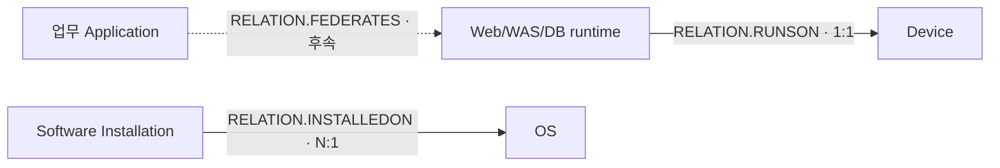

# Application CI 수집 설계

> 상태: 1차 추천안 · 2026-09-16 읽기 전용 조사 완료 · 구현·MAS UI 적용 전.
> 원천 재조회: [Application Component 표본·분포](../../exploration-queries/device42/db-instance-appcomp-device.sql)
> 타겟 재조회: [Application 분류·관계·승격](../../exploration-queries/maximo/db-app-device-classifications.sql)
> 사업 기준: [사업 추진 범위](../../../requirements/business-scope.md)

Database 본체·Instance·Device 관계는 [Database CI 수집 설계](databaseinstance.md)에 둔다.
이 문서는 업무 Application, WEB/WAS runtime, 기타 설치 SW의 관리 단위와 분류를 다룬다.

## 1. 사업 범위

사업 범위는 WEB/WAS와 기타 SW에 대해 설치 경로·SW명·버전 수집을 명시한다. 따라서 기술
Application runtime과 설치 SW는 독립 CI 수집 대상이다.

반면 카드계·채널계 같은 논리 **업무 Application 본체**를 독립 CI로 만들라는 요구는 제공된
발췌에 명시돼 있지 않다. Application Group·Business Service 원천과 업무 관리 필요를 조사해
추가 결정한다.

## 2. 관리 계층

| 계층 | 의미 | 대표 예 | 추천 분류 | 관계 |
| --- | --- | --- | --- | --- |
| 업무 Application | 여러 기술 구성요소를 묶는 논리 시스템 | 카드계·채널계 | `APP.APPLICATION` | runtime·Device와 `RELATION.FEDERATES` |
| Web Server runtime | HTTP 서버 실행 단위 | Apache HTTP Server | `APP.WEB.WEBSERVER` | Device에 `RELATION.RUNSON` |
| Application Server runtime | WAS/J2EE 서버 실행 단위 | Tomcat, 범용 WAS | `APP.GENERICAPPSERVER` | Device에 `RELATION.RUNSON` |
| 설치 SW | OS에 설치된 제품 한 건 | Agent·일반 패키지 | `APP.SOFTWAREINSTALLATION` | OS에 `RELATION.INSTALLEDON` |

`APP.APPLICATION`은 현재 `CI.BUSINESSAPPLICATION`으로 승격되며 Device와의 기존 규칙도
`RUNSON`이 아니라 `FEDERATES`다. 기술 runtime 전건에 이 분류를 사용하지 않는다.

## 3. Application Component 원천

`view_appcomp_v1`은 현재 34 / 14건이다.

| 카테고리 | `.68 / .35` | 관측 내용 | 처리 추천 |
| --- | ---: | --- | --- |
| Database | 9 / 6 | DB2·PostgreSQL·MySQL·MariaDB 등 | Database 설계에서 Instance와 중복 제거·보강 |
| Web Server | 7 / 7 | Apache 본체 외 설정 파일·사이트 주소 형태 행 포함 | 대표 runtime만 `APP.WEB.WEBSERVER` |
| Application Layer | 7 / 1 | Tomcat·Kubernetes·BigFix 관련 행 혼재 | 제품이 Application Server인 행만 `APP.GENERICAPPSERVER` |
| NULL | 11 / 0 | BigFix Agent·TADDM·기타 혼재 | 자동 분류하지 않고 설치 SW 원천과 대조 |

한 Device에 최대 3 / 4개의 Component가 있다. 독립 PK가 있다는 이유만으로 전건을 본체 CI로
만들지 않는다. Web Server 카테고리에도 설정 파일·사이트 주소처럼 runtime 본체가 아닌 행이 있어
카테고리만으로 적재하면 중복 CI가 생긴다.

## 4. runtime 대표행 판정

Web/WAS runtime 후보는 다음을 모두 확인한다.

1. `device_fk`가 실제 수집 Device와 연결된다.
2. JSON `products` 또는 `properties`에 제품명·버전·설치 경로가 있거나, 서비스 정보로 실제 실행
   서버임을 확인할 수 있다.
3. 이름이 설정 파일 경로·사이트 주소만 나타내는 행은 본체에서 제외한다.
4. 같은 Device·제품·설치 경로의 중복 후보는 대표행 기준을 확정한 뒤 하나만 적재한다.
5. 분류 불가 행은 `APP.APPLICATION`으로 fallback하지 않고 미해결 건수로 남긴다.

초기 표본에서 확인된 대응은 다음과 같다.

| 표본 | 분류 |
| --- | --- |
| `Apache HTTP Server - <device>` | `APP.WEB.WEBSERVER` |
| `tomcat - <device>` / `Apache Tomcat - <device>` | `APP.GENERICAPPSERVER` |
| 경로·주소만 나타내는 Web Server 행 | 본체 제외, 후속 Config/Endpoint 후보 |
| Kubernetes·BigFix·TADDM 행 | 제품별 별도 분류 또는 설치 SW 대조 전까지 미해결 |

## 5. 본체와 속성

### Web/Application Server runtime

- 이름: Component 대표 이름
- 제품명: JSON 제품명 또는 검증된 runtime 명칭
- 버전: JSON 제품 버전
- 설치 경로: JSON `install_path` 또는 runtime 홈 경로
- Device 연결: `appcomp.device_fk`
- 변경 시각: `last_changed`; 발견 시각으로 대체하지 않음

`APP.WEB.WEBSERVER`와 `APP.GENERICAPPSERVER`는 APPSERVER 계열의 이름·제품명·제품 버전·버전
문자열 속성을 갖는다. 실제 속성 ID와 JSON 경로는 유형별 매핑 문서에서 확정한다.

### 설치 SW

Application Component의 NULL 카테고리 행만으로 설치 SW를 만들지 않는다. 소프트웨어 설치 원천에서
제품명·버전·설치 경로·Device/OS 연결을 확보한 뒤 `APP.SOFTWAREINSTALLATION`으로 적재한다.
Maximo에는 `APP.SOFTWAREINSTALLATION --RELATION.INSTALLEDON--> SYS.OPERATINGSYSTEM` N:1 규칙이 있다.

## 6. 관계

Web/WAS runtime→Device는 물리·가상 Computer 분류쌍에 기존 `RUNSON` 1:1 규칙이 있다.
업무 Application 관계는 논리 원천을 확정한 뒤 구현한다. 같은 Device에서 발견됐다는 사실만으로
업무 Application과 runtime을 연결하지 않는다.

## 7. 승격 기준정보

현재 다음 본체 `CITEMPLATE` 매핑은 0건이다.

- `APP.WEB.WEBSERVER → CI.WEBSERVER`
- `APP.GENERICAPPSERVER → CI.APPSERVER`

`APP.APPLICATION → CI.BUSINESSAPPLICATION` 승격 범위는 이미 한 건 있다. 이 범위를 기술 runtime에
재사용하지 않는다. `APP.SOFTWAREINSTALLATION`의 CI 대응과 승격 범위는 별도 대조가 필요하다.

## 8. 구현 순서

1. Web Server와 Application Server runtime의 대표행 판정 SQL을 확정한다.
2. `APP.WEB.WEBSERVER`, `APP.GENERICAPPSERVER` 본체·공통 속성을 구현한다.
3. runtime→Device `RELATION.RUNSON`을 관계 배치에 추가한다.
4. 기타 SW 설치 원천·자연키와 `SOFTWAREINSTALLATION→OS` 관계를 설계한다.
5. Application Group·Business Service를 조사해 업무 Application 포함 여부와 자연키를 결정한다.
6. MAS UI에서 runtime·설치 SW 승격 범위와 전달 속성을 설계·적용한다.
