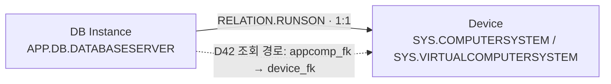

# DB Instance · Application Component · Device 설계

> 상태: 추천안 · 2026-09-16 읽기 전용 재조사 완료 · 구현·MAS UI 적용 전.
> 원천 재조회: [DB Instance 경로와 Application Component 표본](../../exploration-queries/device42/db-instance-appcomp-device.sql)
> 타겟 재조회: [DB·Application·Device 분류와 관계](../../exploration-queries/maximo/db-app-device-classifications.sql)
> 기존 Instance 매핑: [Database Instance](../../data-mapping/ci/types/database-instance.md)

수치는 `.68 / .35` 순이다. 이 문서는 `view_appcomp_v1`이라는 뷰 이름만 보고
Application CI를 만들지 않고, 원천 객체의 의미와 Maximo 분류를 구분하기 위한 설계안이다.

## 1. 현재 원천 경로

Device42의 참조 방향은 다음과 같다.

```text
view_databaseinstance_v2.appcomp_fk
  → view_appcomp_v1.appcomp_pk
  → view_appcomp_v1.device_fk
  → view_device_v2.device_pk
```

| 항목 | `.68` | `.35` |
| --- | ---: | ---: |
| DB Instance | 1 | 3 |
| Application Component 연결 | 1 | 3 |
| Device까지 연결 | 0 | 3 |
| 연결된 Device 수 | 0 | 2 |

`.68`의 Instance는 `BigFix Servers` Component까지 연결되지만 Component의 `device_fk`가 NULL이다.
`.35`의 세 Instance는 모두 Device까지 연결된다. 한 Device에 여러 Instance가 연결될 수 있고,
원천의 `device_fk`는 단일 값이므로 Instance 하나가 가리키는 Device는 최대 한 대다.

경로의 중간 객체가 곧 별도 관리 CI라는 뜻은 아니다. `.35`의 Oracle Instance 한 건은
`Web Server` 카테고리의 `Apache HTTP Server - episode` Component를 경유하며, 그 JSON 제품값은
Oracle Database다. 따라서 Application Component의 이름·카테고리를 DB Instance의 분류나 이름으로
대체하면 잘못된 결과가 생긴다.

## 2. 추천 토폴로지

DB Instance 관계에서는 Application Component를 별도 CI로 끼우지 않는다.
원천 FK는 Component를 경유해 Device를 찾되, Maximo에는 업무 의미를 직접 저장한다.



분류쌍 규칙은 Maximo에 이미 존재한다.

| Source | Relation | Target | Cardinality | Containment |
| --- | --- | --- | --- | ---: |
| `APP.DB.DATABASESERVER` | `RELATION.RUNSON` | `SYS.COMPUTERSYSTEM` | `1:1` | 0 |
| `APP.DB.DATABASESERVER` | `RELATION.RUNSON` | `SYS.VIRTUALCOMPUTERSYSTEM` | `1:1` | 0 |

저장 방향은 `DB Instance --RUNSON--> Device`다. `host_name` 이름 조인은 사용하지 않는다.
두 FK가 모두 실제 행과 일치할 때만 관계를 만들고, `.68`처럼 `device_fk`가 없으면 Instance 본체는
유지하되 관계를 만들지 않고 미해결 건수로 남긴다.

## 3. 분류 선택

| 관리 대상 | Actual CI 분류 | Authorized CI 분류 | 판정 |
| --- | --- | --- | --- |
| DB Instance | `APP.DB.DATABASESERVER` | `CI.DATABASESERVER` | 기존 결정 유지 |
| 물리 Device | `SYS.COMPUTERSYSTEM` | `CI.COMPUTERSYSTEM` | 현행 Device 매핑 유지 |
| VM Device | `SYS.VIRTUALCOMPUTERSYSTEM` | `CI.VIRTUALCOMPUTERSYSTEM` | 현행 Device 매핑 유지 |
| Web Server runtime | `APP.WEB.WEBSERVER` | `CI.WEBSERVER` | Component 후속 수집 시 사용 |
| 범용 Application Server runtime | `APP.GENERICAPPSERVER` | `CI.APPSERVER` | Tomcat 등 서버형 Component의 안전한 기본값 |
| 업무 Application | `APP.APPLICATION` | `CI.BUSINESSAPPLICATION` | `view_appcomp_v1` 일괄 매핑에 사용하지 않음 |

`APP.APPLICATION`은 현재 승격 범위에서 `CI.BUSINESSAPPLICATION`으로 연결된다. 또한 Device와의
기존 관계도 `RUNSON`이 아니라 `RELATION.FEDERATES`다. 반면 D42 Application Component 표본은
DB 서버·Web 서버·Tomcat·Kubernetes·BigFix agent가 섞인 발견 소프트웨어 객체다.
따라서 뷰 전체를 `APP.APPLICATION`으로 넣으면 기술 런타임을 업무 Application으로 오분류한다.

## 4. Application Component 처리 기준

`view_appcomp_v1`은 현재 34 / 14건이며 카테고리가 다음처럼 섞여 있다.

| 카테고리 | `.68 / .35` | 처리 추천 |
| --- | ---: | --- |
| Database | 9 / 6 | 연결 DB Instance의 보강·Device 탐색 원천. 같은 runtime을 별도 CI로 중복 생성하지 않음 |
| Web Server | 7 / 7 | 대표 runtime 행을 식별한 뒤 `APP.WEB.WEBSERVER` 후보 |
| Application Layer | 7 / 1 | 제품이 Application Server임을 확인한 행만 `APP.GENERICAPPSERVER` 후보 |
| NULL | 11 / 0 | BigFix agent·TADDM·기타가 섞이므로 자동 분류하지 않음 |

같은 Device에 최대 3 / 4개의 Component가 있고, Web Server 카테고리에는 실제 서버 행뿐 아니라
설정 파일·사이트 주소처럼 보이는 행도 함께 존재한다. 카테고리만으로 전건 CI를 만들지 않고
JSON의 제품·서비스·설치 경로와 대표행 판정 기준을 먼저 설계해야 한다.

DB Instance와 연결된 Database Component는 다음 값의 보강에만 사용한다.

- `device_fk`: `RUNSON` 대상 Device 탐색
- 제품명·버전·설치 경로: DB Instance 속성 보강 후보
- `last_changed`: Component 원천 변경 시각. Instance의 발견 시각으로 대체하지 않음

Application Component 자체를 수집하는 후속 단계에서는 DB 경로와 분리해 유형별로 구현한다.
업무 Application이 필요하면 `view_applicationgroup_v2` 등 논리 애플리케이션 원천을 별도 조사한다.

## 5. 승격 기준정보 상태

현재 `CITEMPLATE`에는 다음 본체 매핑이 모두 0건이다.

- `APP.DB.DATABASESERVER → CI.DATABASESERVER`
- `APP.WEB.WEBSERVER → CI.WEBSERVER`
- `APP.GENERICAPPSERVER → CI.APPSERVER`

따라서 Actual CI 적재와 `RUNSON` 관계는 기존 분류·규칙으로 구현할 수 있지만, Authorized CI 승격은
MAS UI에서 승격 범위를 설계·등록하기 전에는 완료되지 않는다. `APP.APPLICATION → CI.BUSINESSAPPLICATION`
승격 범위 한 건은 이미 있으나, 이 설정을 기술 Component에 재사용하지 않는다.

## 6. 구현 순서

1. DB Instance 본체를 `APP.DB.DATABASESERVER`로 구현한다.
2. 원천 조회에서 `appcomp_fk → device_fk` 경로를 보존하고 양쪽 실제 행 일치를 검증한다.
3. `DB Instance --RELATION.RUNSON--> Device` 관계를 관계 배치에 추가한다.
4. `.35` 기대 3건, `.68` 기대 0건과 미해결 1건을 검증한다.
5. DB Instance의 제품명·버전·설치 경로 보강 규칙을 별도로 확정한다.
6. Web/WAS 요구를 진행할 때 Application Component의 대표 runtime 필터와 유형별 분류를 설계한다.
7. CI 승격이 필요하면 MAS UI에서 세 승격 범위와 전달 속성을 별도 설계·적용한다.

현재 추천은 **DB Instance와 Device를 먼저 직접 연결하고, Application Component 전체의 CI 적재는
분리해서 보류**하는 것이다.
