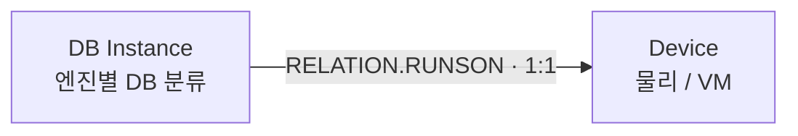

# databaseinstance CI 수집 설계

> 상태: 엔진별 분류와 속성 기준은 2026-09-16 확정 · 본체·속성·관계 구현 완료 · 실제 적재·MAS UI 적용 전.
> 원천 재조회: [DB Instance 연결 경로](../../exploration-queries/device42/db-instance-appcomp-device.sql)
> 타겟 재조회: [DB 분류·관계·승격](../../exploration-queries/maximo/db-app-device-classifications.sql)
> 타겟 관측 사실: [DB Instance 분류·스펙·관계 정의](../../knowledge/maximo/db-classification-specs.md)
> 매핑 정본: [Database](../../data-mapping/ci/types/database.md), [Database Instance](../../data-mapping/ci/types/database-instance.md)

수치는 `.68 / .35` 순이다. Application Component 자체의 수집 설계는
[Application CI 수집 설계](application.md)에 둔다. 이 문서에서는 DB Instance가 Device를 찾기 위해
Component를 경유한다는 원천 연결만 다룬다.

## 1. 관리 단위

| 단위 | 원천 | 역할 | 판정 |
| --- | --- | --- | --- |
| DB Instance | `view_databaseinstance_v2` | Device에서 실행되는 DBMS Instance | 독립 CI. 사업 범위의 DB SW명·버전·설치 경로 수집 중심 |
| Database | `view_database_v2` + 동일 PK Resource | Instance 내부의 논리 DB | 기존 독립 CI 매핑 유지. 사업 범위에 개별 DB가 명시되지는 않아 우선순위 별도 |
| DB 관련 Application Component | `view_appcomp_v1` | Device 연결과 제품·버전·경로 보강 | Instance와 같은 runtime이면 별도 중복 CI를 만들지 않음 |

Instance와 동일 PK·이름의 Resource는 같은 본체의 보강 원천이다. 별도 CI를 만들지 않는다.

## 2. 현재 원천

| 항목 | `.68` | `.35` |
| --- | ---: | ---: |
| DB Instance | 1 | 3 |
| DB Instance→Application Component 연결 | 1 | 3 |
| DB Instance→Component→Device 연결 | 0 | 3 |
| 연결된 Device 수 | 0 | 2 |
| Database | 10 | 37 |
| Instance→Database FK 쌍 | 9 | 37 |

관측 엔진은 `.68`이 Microsoft SQL 1건, `.35`가 DB2·Oracle Database·PostgreSQL 각 1건이다.
`.68`의 Database 10건 중 1건은 `databaseinstance_fk`가 없어 쌍이 9건이다.

## 3. DB Instance 분류

**엔진별 분류 + 범용 fallback**을 사용한다. 기존의 단일 `APP.DB.DATABASESERVER` 결정을 대체한다.

| `database_type` | Actual CI | Authorized CI | 현재 표본 `.68 / .35` |
| --- | --- | --- | --- |
| Microsoft SQL | `APP.DB.MSSQL.SQLSERVER` | `CI.SQLSERVER` | 1 / 0 |
| DB2 | `APP.DB.DB2.DB2INSTANCE` | `CI.DB2INSTANCE` | 0 / 1 |
| Oracle Database | `APP.DB.ORACLE.ORACLEINSTANCE` | `CI.ORACLEINSTANCE` | 0 / 1 |
| PostgreSQL·미지원 엔진 | `APP.DB.DATABASESERVER` | `CI.DATABASESERVER` | 0 / 1 |

네 Actual CI 분류는 속성 적용 설정과 물리·가상 Device 대상 `RELATION.RUNSON` 규칙을 모두 가진다.
PostgreSQL 전용 분류는 현재 Maximo에 없다. 엔진 문자열은 분류 판정 후에도 제품명 속성에 보존한다.

범용 분류 후보는 `APP.DB.DATABASESERVER`와 `APP.DB.GENERICDATABASESERVER` 둘이었고
앞을 골랐다. 두 분류는 관계 규칙이 IN·OUT 모두 완전히 같고 CLASSSPEC 차이가
`GENERICDATABASESERVER_GENERICTYPE` 하나뿐이다. 대조는
[분류·스펙·관계 정의](../../knowledge/maximo/db-classification-specs.md) 5절에 있다.
그 하나의 속성에 넣을 값이 `database_type`이라 `APPSERVER_PRODUCTNAME`과 같은 문자열이 되고,
승격 대상 `CI.DATABASESERVER`와 이름도 그대로 대응한다. Switch가
`GENERICCOMPUTERSYSTEM_GENERICTYPE`을 쓰는 것과 다른 판단인 이유는 그쪽 `networkKind`는
다른 속성에 들어가지 않기 때문이다.

엔진별 분류의 이점은 분류 검색과 관계 규칙 쪽이다. 전용 속성 확장은 이점으로 계산하지 않는다.
6절에서 보듯 엔진 전용 속성 11개 중 D42에 원천이 있는 것은 두세 개뿐이다.
비용은 분류 라우팅과 승격 범위가 네 갈래가 되는 것이다. 네 표본 모두 `database_type`이
존재하므로 분류 정확성의 이점이 더 크다고 보고 엔진별 분류를 택했다.

Database 본체는 기존처럼 `APP.DB.DATABASE`를 사용한다. DB 엔진은 연결된 Instance의 분류로
표현하며 개별 Database를 SQL Server·Oracle 전용 분류로 다시 분기하지 않는다.

## 4. DB Instance → Device

Device42 조회 경로는 다음과 같다.

```text
databaseinstance.appcomp_fk
  → appcomp.appcomp_pk
  → appcomp.device_fk
  → device.device_pk
```

중간 Application Component를 별도 관계 노드로 만들지 않고 Maximo에는 업무 의미를 직접 저장한다.



| Source 분류 | Relation | Target 분류 | Cardinality | Containment |
| --- | --- | --- | --- | ---: |
| `APP.DB.MSSQL.SQLSERVER` | `RELATION.RUNSON` | `SYS.COMPUTERSYSTEM` / `SYS.VIRTUALCOMPUTERSYSTEM` | `1:1` | 0 |
| `APP.DB.DB2.DB2INSTANCE` | `RELATION.RUNSON` | 위와 같음 | `1:1` | 0 |
| `APP.DB.ORACLE.ORACLEINSTANCE` | `RELATION.RUNSON` | 위와 같음 | `1:1` | 0 |
| `APP.DB.GENERICDATABASESERVER` | `RELATION.RUNSON` | 위와 같음 | `1:1` | 0 |

저장 방향은 `DB Instance --RUNSON--> Device`다. `host_name` 이름 조인은 사용하지 않는다.
`appcomp_fk`와 `device_fk`가 모두 실제 행과 일치할 때만 관계를 만들며, `.68`의 미연결 Instance는
본체를 유지하고 관계 미해결 건수로 기록한다.

Application Component의 이름·카테고리를 Instance 분류에 사용하지 않는다. `.35`의 Oracle
Instance가 `Web Server` 카테고리의 `Apache HTTP Server - episode` Component를 경유하는 표본이 있다.

## 5. DB Instance → Database

원천은 `database.databaseinstance_fk → databaseinstance.databaseinstance_pk`다. 방향은
`DB Instance → Database`이며 원천 쌍은 `.68` 9건, `.35` 37건이다.

이 관계는 **지금 적재할 수 없다.** 다섯 DB Instance 분류 → `APP.DB.DATABASE`의 분류쌍
`RELATIONRULES`가 RELATIONNUM 무관하게 0건이고, MERGE 가드가 규칙 없는 쌍을 전건 거부한다.
`RELATION.CONTAINS` 코드의 존재는 분류쌍 규칙의 존재가 아니다. MAS UI 등록이 선행 조건이다.
`.68`은 명시 FK 기준 9쌍, `instance_id`·Resource `root_resource_fk` 기준 10쌍으로 1건 차이가 있다.
이 차이의 보강 여부는 ISSUE-11이다.

## 6. 속성 기준 — CI 분류 합집합 우선

수집 속성의 대조 기준은 승격 대상 CI 분류가 제공하는 속성이다. OS가 `CI.OS` 7개를
기준으로 삼은 것과 같은 규약이다. 네 CI 분류의 합집합은 공통 8개 + 엔진 전용 11개이고,
**19개 전부 대응 ACTCI 분류에 이미 있다.** ACTCI용 속성을 새로 만들 필요는 없다.
분류별 속성 목록은 [DB Instance 분류·스펙·관계 정의](../../knowledge/maximo/db-classification-specs.md) 2·3절이다.

공통 8개의 원천 커버리지다. 값은 `.68` Microsoft SQL 1건과 `.35` 3건에서 관측했다.

| CI 공통 속성 | D42 원천 | 관측 |
| --- | --- | --- |
| APPSERVER_NAME | `i.dbinstance_name` | 4/4 |
| APPSERVER_PRODUCTNAME | `i.database_type` | 4/4 |
| APPSERVER_PRODUCTVERSION | `r.details->>'version'` | 4/4. 최장 238자로 ALNVALUE 254 안에 들어간다 |
| APPSERVER_KEYNAME | `r.identifier` | 4/4. `database_instance\|<이름>\|<호스트>` 형식 |
| DATABASESERVER_HOME | `a.json->products->0->>'install_path'` | 1/4. `.35` DB2만 있다 |
| APPSERVER_VENDORNAME | 없음 | `database_type` 기준 고정표로 채울지 확정 필요 |
| APPSERVER_EXECUTABLENAME | 없음 | 수집하지 않는다 |
| APPSERVER_STATUS | 없음 | NUMERIC. 상태 코드 도메인도 미확인 |

엔진 전용 11개는 원천이 거의 없다. `SQLSERVER_*` 6개는 전부 없고, `*_PORT` 2개도 없다.
후보가 있는 것은 `ORACLEINSTANCE_HOSTNAME`·`ORACLEINSTANCE_SID`·`DB2SERVER_NODENAME` 셋이며
표본이 각 1건이고 의미 대응이 확실하지 않다. 1단계에서는 공통 8개 중 원천이 있는 것만 구현하고
전용 속성은 표본이 늘어난 뒤 정한다. 빈 전용 속성을 추정하거나 공통 값을 다른 의미의 속성에
복제하지 않는다.

`ACTCI.LASTSCANDT`는 Maximo에서 `REQUIRED=1`이고 Resource의 `last_discovered`는 두 서버 전건
NULL이다. 그대로는 한 건도 적재되지 않으므로 Instance 레코드의 갱신 시각인 `r.last_changed`를 쓴다.
연결 Device의 발견 시각은 다른 개체의 값이라 쓰지 않는다.

본체 값은 Instance와 동일 PK Resource를 기준으로 한다. 연결 Application Component에서는
설치 경로와 `device_fk`만 쓴다. Component의 제품 버전은 쓰지 않는다. `.35` DB2에서 Resource가
`DB2 v12.1.4.0`, Component products가 `11.5.4.0`으로 서로 다르다. Component 이름도 쓰지 않는다.
`.35` Oracle은 `Apache HTTP Server - episode`, `.68` MSSQL은 `BigFix Servers`에 연결돼 있다.
Component 변경 시각은 진단값이며 Instance 발견 시각으로 대체하지 않는다.

## 7. 승격 기준정보

네 엔진 조합의 `CITEMPLATE` 본체 매핑은 모두 0건이다. 목록과 근거는
[분류·스펙·관계 정의](../../knowledge/maximo/db-classification-specs.md) 6절에 있다.
Actual CI 적재와 RUNSON 관계는 현재 설정으로 구현할 수 있다. Authorized CI 승격은
MAS UI에서 네 승격 범위와 전달 속성을 등록·검증한 뒤 가능하다.

## 8. 구현 순서

1. **완료.** DB Instance 본체와 CI 공통 속성 5개 + 범용 분류의 GENERICTYPE을 구현했다.
   분류는 `database_type` 라우팅이며 매핑 정본은
   [Database Instance](../../data-mapping/ci/types/database-instance.md)다.
2. **완료.** `DB Instance --RUNSON--> Device` 관계를 `CiRelationSource` 상수 하나로 추가했다.
3. `./run.sh ci`로 실제 적재하고 `.35` 관계 3건, `.68` 본체 1건·관계 0건과 기존 UI 샘플
   `ACTCIRELATIONID=5001`의 멱등성을 검증한다.
4. MAS UI에서 엔진별 승격 범위와 전달 속성을 등록한다.
5. 엔진 전용 속성과 Instance→Database 관계는 표본·규칙이 갖춰진 뒤 별도로 진행한다.

