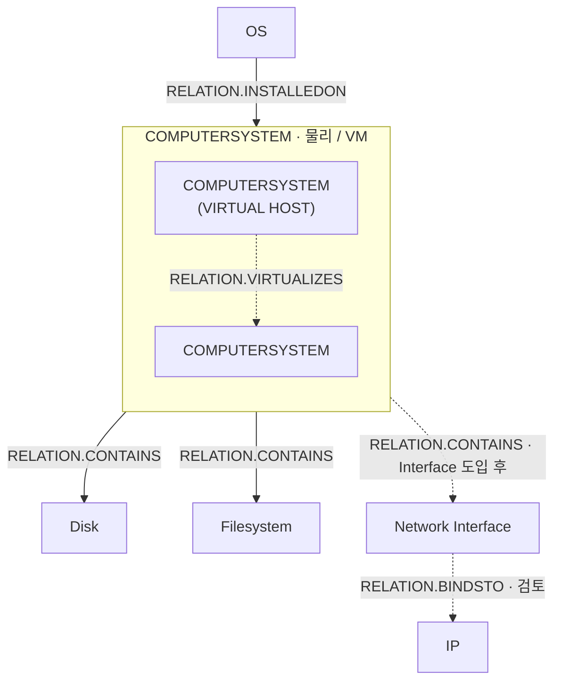

# Computer 중심 CI 관계 설계

> 2026-09-15 조사 결과에 따른 설계다. OS→Computer·Computer→Disk·Computer→Filesystem 세 관계는
> 구현해 운영 적재까지 검증했다(아래 표). Host→VM·Interface→IP는 여전히 설계 단계 제안이며 코드가 없다.
> 원천 근거: [D42 관계 원천](../../knowledge/device42/computer-ci-relations.md).
> 타겟 근거: [Maximo 관계 정의](../../knowledge/maximo/computer-ci-relations.md).
> 미결 정본: [ISSUE-11](../../open-issues.md#issue-11-actual-ci-분류속성관계와-식별자-매핑).

## 먼저 구현할 관계

| 규칙 이름 제안 | 토폴로지 의미 방향 | 정확한 relationnum | 판정 |
| --- | --- | --- | --- |
| COMPUTER_CONTAINS_DISK | Computer → Disk | RELATION.CONTAINS | 2026-09-15 `./run.sh ci-relation` 자동 적재 19건, 재실행 `ACTCIRELATIONID` 동일 확인(멱등성) |
| COMPUTER_CONTAINS_FILESYSTEM | Computer → Filesystem | RELATION.CONTAINS | 2026-09-15 자동 적재 60건, 재실행 ID 동일 확인. `filesystem-array-fanout` 0건 — 원천(D42 .35) 재조회로 원인 확인: `device_fks`가 Computer 둘 이상인 마운트포인트가 현재 없음(`pair_cnt=mountpoint_cnt=60`). 적재 결함 아님. 배열 펼침 경로 자체는 미검증 |
| OS_INSTALLED_ON_COMPUTER | OS → Computer | RELATION.INSTALLEDON | 2026-09-15 자동 적재 63건(물리 5·가상 58 분류쌍 모두 관측), 기존 수동 샘플 `ACTCIRELATIONID=6001` 유지·재실행 ID 동일 확인(멱등성) |
| HOST_VIRTUALIZES_VM | Host Computer → VM | RELATION.VIRTUALIZES | 의미 방향 확정. Maximo 저장 순서·1:1 설정·SWAPPED·표시 검증 전 보류 |
| COMPUTER_CONTAINS_INTERFACE | Computer → Interface | RELATION.CONTAINS | Interface CI 미구현. 별도 유형 도입 후 |
| INTERFACE_BINDS_IP | Interface → IP | RELATION.BINDSTO | Interface 도입·카디널리티·미연결 IP 처리 검토 후 |
| COMPUTER_IP 직접 연결 | 미선정 | 미선정 | 명시 규칙 없음. 기존 코드의 이름만 빌려 연결하지 않음 |

Computer는 물리·가상 두 분류를 허용한다.
OS → 물리 Computer의 단건 결과는 [검증 기록](../../knowledge/maximo/computer-ci-relations.md#oscomputer-승격-샘플-검증)을 참조한다.
OS는 설치 사실을 매핑한다. device 연결만으로 실행 상태까지 확인한 것으로 보고 RUNSON을 함께 만들지 않는다.

## 관계도 — 화살표는 토폴로지 의미 방향



실선은 우선 구현 매핑, 점선은 보류·확장 후보다.
`COMPUTERSYSTEM · 물리 / VM`은 별도 CI 하나가 아니라 Device 본체 분류 범위를 묶어 보여 주는 영역이다.
Virtual Host와 VM은 모두 그 영역의 Device CI이며, Host→VM 가상화 관계를 영역 안에서 표현한다.
Disk·Filesystem·OS·Interface 관계는 두 역할과 중복 노드를 따로 그리지 않고 ComputerSystem 영역에 연결한다.
가상화 관계는 사람이 읽는 의미에 맞춰 `Virtual Host → VIRTUALIZES → VM`으로 표시한다.
D42 원천 참조는 반대로 VM의 `virtual_host_device_fk`가 Host의 `device_pk`를 가리킨다.
현재 Maximo 규칙은 `SYS.VIRTUALCOMPUTERSYSTEM → C`, `SWAPPED=1`, `1:1`이므로
ACTCIRELATION의 실제 SOURCECI·TARGETCI 순서는 적재·UI 검증 후 확정한다. 토폴로지 화살표를
원천 FK 방향이나 물리 저장 순서로 해석하지 않는다.

## 실행 위치 — CI 본체 적재 이후 별도 단계

관계는 본체 task 안에서 저장하지 않는다. 모든 본체·스펙 task가 끝난 뒤 관계 단계를 실행한다.

```text
./run.sh ci            CiIntegrationJob
                         1. 분류·속성 기준정보 조회
                         2. CI 본체·스펙 task 실행   Computer · OS · Disk · Filesystem · IP
                         3. CiRelationJob.run()

./run.sh ci-relation   CiRelationJob                 관계만
```

`JobRunner`가 인자를 순서대로 실행하므로 빈 이름 두 개로 진입점 두 개를 얻는다.
관계 구현은 `CiRelationJob` 한 곳에만 있고 `CiIntegrationJob`이 그것을 호출한다.
`./run.sh ci ci-relation`처럼 둘 다 주면 관계가 두 번 돈다. MERGE라 결과는 같다.
중복 실행 방지 장치를 따로 만들지 않고 실행 설명에 적는다.

분리하는 이유:

- 관계의 실행 위치·실패 처리·재실행 방식을 하나로 통일하고, 관계만 독립 재실행할 수 있다.
- 상대 CI가 뒤쪽 배치에 있어 누락되는 경우를 구조적으로 없앤다. 본체 task 안에서 저장하면
  Computer를 먼저 실행하도록 명시적 순서를 걸어야 하고, Host–VM처럼 같은 유형 안의
  선후 관계는 그 순서로도 해결되지 않는다.
- 본체용 중복 제거와 관계의 연결 보존을 분리한다. 본체가 이미 축약한 결과를 관계에
  재사용하는 실수를 만들지 않는다.

관계 단계가 시작됐다는 것이 본체 적재의 성공을 뜻하지는 않는다.
저장 전제는 아래 「저장 전제와 이번 조사 한계」를 따른다.

## 구조 — 정의는 enum 상수, 처리는 한 곳

관계마다 클래스를 만들지 않는다. 도메인별 `OsRelationSource` 같은 클래스로 이름만 바꿔도
조회·페이징·매핑 루프가 그 안에서 반복되면 같은 문제다.
**관계를 하나 더 붙일 때 늘어나는 것은 enum 상수 하나여야 한다.**

| 파일 | 역할 | 관계가 늘면 |
| --- | --- | --- |
| `integration/ci/relation/CiRelationSource` | 상수 하나 = relationnum + 건수 SQL + 페이지 SQL | **상수 추가** |
| `integration/ci/relation/CiRelationJob` | `values()` 순회 · 페이징 · 변환 · 집계 | 변경 없음 |
| `integration/ci/relation/ActCiRelationWriter` | 공통 MERGE · 건별 오류 격리 | 변경 없음 |
| `dto/maximo/ci/ActCiRelationUpsert` | sourceCiNum · targetCiNum · relationNum | 변경 없음 |

enum 하나로 합친 이유는 관계 하나에 상수가 둘이 되는 것을 막기 위해서다.
relationnum과 조회 SQL은 관계마다 1:1이라 `CiRelationRule`을 따로 둘 이유가 없다.
허용 분류 집합은 넣지 않는다. MERGE가 실제 ACTCI 행과 RELATIONRULES로 검사한다.

enum을 `enums/ci`가 아니라 관계 패키지에 두는 이유는 D42 SQL을 담기 때문이다.
`enums/ci`는 Maximo 메타데이터만 두고, SQL은 기존 `*CiIntegrate`처럼 적재 코드 옆에 둔다.
이를 위해 `CiSourceFilter`를 public으로 연다.

`CiRelationJob`은 `CiDefinitionCache`를 받지 않는다. 관계 저장에 분류·속성 정의가
필요 없으므로 `ci-relation` 단독 실행이 본체 기준정보 로딩에 의존하지 않는다.

전용 클래스는 **실제로 별도 처리 로직이 필요할 때만** 도입한다. 여러 API 조합이나
별도 상태·판정이 필요한 도메인이 나타나면 그때 그 도메인만 분리한다.
SQL로 끝나는 관계를 위해 미리 인터페이스와 구현체 체계를 만들지 않는다.

## 정의 하나가 담는 것

```text
relationnum    정확한 RELATION 코드. RELATION.CONTAINS와 CONTAINS를 구분한다
건수 SQL       COUNT. DOQL이 FROM 서브쿼리를 막으므로 페이지 SQL과 별도로 쓴다
페이지 SQL     sourceci·targetci 두 컬럼
               ORDER BY sourceci,targetci LIMIT %d OFFSET %d
```

공통 실행기가 Writer에 넘기는 값은 출발 ACTCINUM, 도착 ACTCINUM, relationnum 셋뿐이다.
예상 분류는 넘기지 않는다. 근거는
[공통 매핑 3절](../../data-mapping/ci/actcirelation.md#3-공통-저장-sql-제안)에 있다.

각 상수가 어느 원천의 연결 근거로 쌍을 만드는지는 다음과 같다.

| 상수 | 관계 | 연결 근거 | 매핑 정본 |
| --- | --- | --- | --- |
| OS_INSTALLED_ON_COMPUTER | OS → Computer | `deviceos_pk` · `device_fk` | [os.md](../../data-mapping/ci/types/os.md#6-관계-매핑--2026-09-15) |
| COMPUTER_CONTAINS_DISK | Computer → Disk | Hard Disk 조건의 `part_pk` · `device_fk` | [device.md](../../data-mapping/ci/types/device.md#7-관계-매핑--2026-09-15) |
| COMPUTER_CONTAINS_FILESYSTEM | Computer → Filesystem | `mountpoint_pk` · `device_fks` | [device.md](../../data-mapping/ci/types/device.md#7-관계-매핑--2026-09-15) |
| HOST_VIRTUALIZES_VM | Host → VM | VM의 `device_pk` · `virtual_host_device_fk`를 역방향 해석 | 보류. Maximo 저장 순서 검증 필요 |
| INTERFACE_BINDS_IP | Interface → IP | `ipaddress_pk` · `netport_fk` | 보류 |

상수 이름과 관계 열은 토폴로지 의미를 따른다. SQL은 연결 근거를 가진 원천에서 나오므로
Host→VM 관계도 VM 행의 `virtual_host_device_fk`를 읽어서 만든다.
문서 정본은 기존 규약대로 출발 유형 문서가 소유하므로 SQL을 양쪽에 복사하지 않는다.

수집 범위 필터는 각 페이지 SQL의 `WITH computer AS (...)` 안에 둔다.
본체와 같은 `CiSourceFilter.COMPUTER` 조건을 쓴다.
정렬은 두 SQL 모두 `sourceci,targetci`다. DOQL은 ORDER BY 없는 OFFSET의 순서를 보장하지 않는다.
전체 ACTCI를 메모리에 올려 이름으로 찾지 않는다. 양 끝은 원천의 확인된 연결 키로 만든다.
본체 task가 관계 후보를 누적해 넘기지 않는다. 관계 단계가 연결 키만 다시 읽는다.

## 세 관계가 같은 구조에 들어가는가

OS 하나만 보고 공통 구조를 확정하면 단일 FK 관계에 맞춰진다.
Disk·Filesystem의 요구까지 대조했다.

| 요구 | 어디서 처리되나 | OS | Disk | Filesystem |
| --- | --- | --- | --- | --- |
| 물리·가상 Computer 판별 | MERGE가 저장된 ACTCI 분류로 RELATIONRULES를 확인. 원천의 예상 분류와 대조하지 않는 최소 정책 | 도착이 둘 | 출발이 둘 | 출발이 둘 |
| 배열의 전체 연결 | 페이지 SQL. `c.device_pk=ANY(m.device_fks)`가 쌍으로 펼친다 | 해당 없음 | 해당 없음 | 필요 |
| 관계별 수집 필터 | 페이지 SQL 안 | Computer 조인 | `pm.type_name='Hard Disk'` | fstype 제외 목록 |
| 안정적 페이징 | 공통 실행기. 정렬 키가 `sourceci,targetci`로 동일 | 가능 | 가능 | 가능 |

세 SQL 모두 두 D42 서버에서 실행 검증했고 결과 컬럼이 `sourceci`·`targetci`로 같다.
Filesystem만 원천 한 행이 여러 쌍을 내지만 그것은 조인 결과일 뿐이고,
실행기·DTO·Writer는 똑같이 쌍 하나를 처리한다. 구조를 바꿀 필요가 없다.

이 대조는 2026-09-15 `./run.sh ci-relation` 운영 적재로 검증했다. 한 번의 실행에서
OS_INSTALLED_ON_COMPUTER(63건)·COMPUTER_CONTAINS_DISK(19건)·COMPUTER_CONTAINS_FILESYSTEM(60건)
세 관계가 모두 적재됐고, 세 상수 모두 같은 `CiRelationJob`·`ActCiRelationWriter`를 거쳤다.
공통 구조를 관계별로 분기하지 않았다. 재실행에서도 세 관계 모두 `ACTCIRELATIONID`가
유지됐다(멱등성). 검증 쿼리는 [관계 적재 검증](../../exploration-queries/maximo/ci-relation-load-check.sql).

## 본체 중복 제거와 관계 보존

- 본체는 원천 개체 PK마다 하나. 관계는 (SOURCECI,TARGETCI,RELATIONNUM)마다 하나.
- IP·Filesystem의 device_fks는 단일 장비로 축약하지 않는다.
- 기존 DISTINCT ON은 본체 적재에 유지한다. 관계 단계는 본체 조회를 재사용하지 않고
  연결 쌍을 전용 SELECT로 다시 읽으므로 배열이 축약되지 않는다.
  마운트포인트 10에 device_fks={173,174}이면 관계는 두 행이다.
- 관계 조회에서 제거하는 중복은 최종 관계 키 (SOURCECI,TARGETCI,RELATIONNUM)가 같은 경우뿐이다.
- IP 관계는 원천에서 netport_fk와 장비 배열을 읽어야 한다. 본체 DTO에는 없다.
  Interface 도입 시 관계 조회 정의에서 확보한다.
- netport_fk가 없는 IP를 같은 장비의 임의 포트에 연결하지 않는다.

## 저장 전제와 이번 조사 한계

[ACTCIRELATION 공통 매핑](../../data-mapping/ci/actcirelation.md)의 고유키와 가드를 사용한다.
양 끝 ACTCI가 실제로 있는지, 그 둘의 실제 분류쌍에 해당 관계 규칙이 있는지 확인한다.
**최소 정책:** 관계는 실행 시점에 DB에 저장되어 있는 CI의 존재와 분류·규칙만 본다.
본체 task 일부가 실패해도 관계 단계는 그대로 진행하며, 실패한 유형의 CI라도
정상 분류로 이미 존재하면 연결한다. `CiRelationJob`은 본체 task의 결과를 참조하지 않는다.

기존 행이 있다는 것은 **이번 실행에서 본체 갱신에 성공했다는 뜻은 아니다**.
이번 실행에 성공한 CI만 연결하려면 ActCiWriter가 성공 건수 대신 식별자를 반환하는
결과 계약이 필요하다. 지금은 만들지 않는다.

관계가 0건 처리됐다고 항상 오류는 아니다. 양 끝 미존재나 규칙 미등록을 나타낼 수 있다.
원인을 구분하려면 실패 건만 추가 조회하거나 사전 캐시와 비교한다.
관계 삭제·재부착 시 이전 관계 정리·원천 스냅샷 일관성·동시 실행 정책은 이번에 확정하지 않는다.
따라서 MERGE만 구현한 상태를 이동·삭제까지 현행화되는 기능이라고 설명하지 않는다.

## 보류 근거

- VM–Host: 원천은 명확하나 복수 VM이 같은 호스트를 참조하는 데이터와 규칙 1:1을 검증해야 한다.
- IP: 직접 규칙이 없다는 것이 물리 저장 불가를 뜻하지는 않는다. 새 규칙 추가 또는 Interface 도입은
  수집 모델 선택이며 이번에 임의 결정하지 않는다. Interface 경로만으로 공유 IP의 모든 장비 연결이 복구되지 않는다.
- OS–Filesystem: BOOTSFROM 규칙은 있지만 같은 장비라는 정보만으로 부팅 파일시스템을 특정할 수 없다.
- Disk–Filesystem: 확인한 두 원천 사이에 직접 FK가 없으며, 중간 볼륨 계층을 추정하지 않는다.
- VM 관리 장비·섀시·Computer 네트워크 연결: 원천 역할/표본과 대상 분류 규칙이 부족하다.
- CPU: 현재 독립 CPU CI 구현이 없다. 규칙은 존재하지만 DPA CPU 적재를 CI 존재로 취급하지 않는다.
