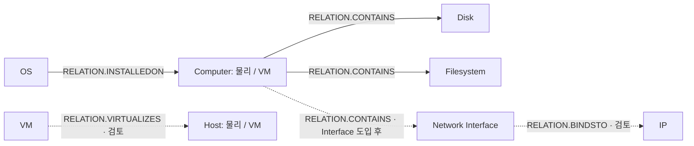

# Computer 중심 CI 관계 설계

> 2026-09-15 조사 결과에 따른 구현 제안. 관계 코드·분류쌍은 재조회했으며 관계 적재 코드는 변경하지 않았다.
> 원천 근거: [D42 관계 원천](../../knowledge/device42/computer-ci-relations.md).
> 타겟 근거: [Maximo 관계 정의](../../knowledge/maximo/computer-ci-relations.md).
> 미결 정본: [ISSUE-11](../../open-issues.md#issue-11-actual-ci-분류속성관계와-식별자-매핑).

## 먼저 구현할 관계

| 규칙 이름 제안 | 저장 방향 | 정확한 relationnum | 판정 |
| --- | --- | --- | --- |
| COMPUTER_CONTAINS_DISK | Computer → Disk | RELATION.CONTAINS | 원천·분류쌍 확인. 구현 가능 |
| COMPUTER_CONTAINS_FILESYSTEM | Computer → Filesystem | RELATION.CONTAINS | 원천·분류쌍 확인. 구현 가능 |
| OS_INSTALLED_ON_COMPUTER | OS → Computer | RELATION.INSTALLEDON | 물리 Computer 단건 INSERT·SWAPPED=0·승격·표시 확인. 자동 저장 구현·가상 Computer 검증은 별도 |
| VM_VIRTUALIZES_HOST | VM → Host Computer | RELATION.VIRTUALIZES | 후보. 1:1 설정·SWAPPED·표시 검증 전 보류 |
| COMPUTER_CONTAINS_INTERFACE | Computer → Interface | RELATION.CONTAINS | Interface CI 미구현. 별도 유형 도입 후 |
| INTERFACE_BINDS_IP | Interface → IP | RELATION.BINDSTO | Interface 도입·카디널리티·미연결 IP 처리 검토 후 |
| COMPUTER_IP 직접 연결 | 미선정 | 미선정 | 명시 규칙 없음. 기존 코드의 이름만 빌려 연결하지 않음 |

Computer는 물리·가상 두 분류를 허용한다. 표의 구현 가능은 소스/타겟 매핑이 갖춰졌다는 뜻이며,
운영 적재·화면·승격 검증을 완료했다는 뜻은 아니다.
OS → 물리 Computer의 단건 결과는 [검증 기록](../../knowledge/maximo/computer-ci-relations.md#oscomputer-승격-샘플-검증)을 참조한다.
OS는 설치 사실을 매핑한다. device 연결만으로 실행 상태까지 확인한 것으로 보고 RUNSON을 함께 만들지 않는다.

## 관계도 — 화살표는 저장 방향

실선은 우선 구현 매핑, 점선은 보류·확장 후보다.
VM→Host는 규칙의 저장 방향이며, 사용자 화면에 어떤 문장/방향으로 보일지는 별도 검증한다.
표시할 관계의 선택은 수집·저장 규칙과 분리하고 이번 조사에서 UI 설정은 바꾸지 않는다.

## 언제, 어디서 저장할지

공통 ActCiRelationWriter가 저장을 담당하고 각 수집 task는 원천에서 관계 DTO를 만든다.

| 관계 | 양 끝을 아는 task | 저장 시점 |
| --- | --- | --- |
| Computer → Disk | DiskCiIntegrate | Computer task 완료 후, Disk 본체 배치 저장 뒤 |
| Computer → Filesystem | FilesystemCiIntegrate | Computer task 완료 후, Filesystem 본체 배치 저장 뒤 |
| OS → Computer | OsCiIntegrate | Computer task 완료 후, OS 본체 배치 저장 뒤 |
| VM → Host | ComputerCiIntegrate 또는 후처리 | **Computer 전체 배치 완료 후**. 후속 배치의 호스트 누락 방지 |
| Interface → IP | 향후 IP 관계 매핑 | Interface 적재 완료 후 |

Computer를 먼저 실행하도록 명시적 순서를 준다. 같은 유형 안의 선후 관계는 @Order로 해결되지 않는다.
같은 task에서 본체·스펙·관계를 처리해도 SQL과 책임은 공통 Writer로 분리한다.
관계 방향이 Computer→Disk라고 Computer task에서 생성할 필요는 없다.

같은 유형의 관계 후처리는 원천의 연결 키만 배치 재조회하는 안을 우선한다.
전체 CI 전역 맵은 불필요하다. 수집 시 관계 후보를 보관하는 방식은 규모·수명 관리가 필요하므로
후속 구현에서 별도 결정한다. 지금은 Disk·Filesystem·OS 때문에 원천 전체를 다시 읽을 이유가 없다.

## 본체 중복 제거와 관계 보존

- 본체는 원천 개체 PK마다 하나. 관계는 (SOURCECI,TARGETCI,RELATIONNUM)마다 하나.
- IP·Filesystem의 device_fks는 단일 장비로 축약하지 않는다.
- 기존 DISTINCT ON은 본체 적재에 유지할 수 있다. 관계를 생성할 때는 원본 배열을 DTO에 보존하거나
  같은 배치의 원천 개체 키에 대한 연결 쌍을 별도로 읽어야 한다.
- IP의 현재 DTO에는 netport_fk와 전체 장비 배열이 없다. 현 상태 그대로 공통 Writer를 호출한다고
  모든 관계가 만들어지는 것은 아니다. Interface 도입 시 원천 DTO를 확장해야 한다.
- netport_fk가 없는 IP를 같은 장비의 임의 포트에 연결하지 않는다.

## 관계 정의의 코드 표현

`enums.ci.CiRelationRule`에 업무상 관계 규칙을 명시하는 안이다.
카테고리 두 개만으로 관계를 자동 결정하지 않는다. 같은 두 유형에도 다른 의미의 관계가 존재한다.

각 규칙이 가질 값:
- 정확한 relationnum
- 허용 출발·도착 CiClassification 집합
- 원천에서 정한 기본 저장 방향

예: COMPUTER_CONTAINS_DISK는 출발 {COMPUTER,VIRTUAL_COMPUTER},
도착 {DISK_DRIVE}, relationnum=RELATION.CONTAINS.
CLASSSTRUCTUREID·관계 규칙은 CI 작업 시작 시 해당 정의만 조회하여 검증할 수 있다.
전체 RELATIONRULES를 전역 캐시하거나 숫자 ID를 enum에 넣을 필요는 없다.
CARDINALITY·CONTAINMENT·REVRELATIONSHIP은 DB 정의를 확인하며 enum에 별도 정본을 만들지 않는다.

DTO 제안: sourceCiNum, targetCiNum, rule. SWAPPED는 규칙 메타데이터의 단순 복사 값이 아니다.
원천 조회 SQL은 각 task가, 관계 MERGE SQL은 공통 Writer가 소유한다.

## 저장 전제와 이번 조사 한계

[ACTCIRELATION 공통 매핑](../../data-mapping/ci/actcirelation.md)의 고유키와 가드를 사용한다.
양 끝 존재뿐 아니라 실제 분류가 매핑의 예상 분류와 일치하고 해당 관계 규칙이 있는지 확인한다.
기존 행이 있다는 것은 **이번 실행에서 본체 갱신에 성공했다는 뜻은 아니다**.
현재 ActCiWriter는 성공 건수만 반환하므로 이번 실행 성공 CI만 연결하려면 결과 계약을 추가해야 한다.
현재 최소안은 저장된 본체의 존재·분류·규칙을 검사하는 것으로, 갱신 성공 여부 검증과 구분한다.

관계가 0건 처리됐다고 항상 오류는 아니다. 미존재·분류 불일치·규칙 미등록을 나타낼 수 있다.
원인을 구분하려면 실패 건만 추가 조회하거나 사전 캐시와 비교한다.
관계 삭제·재부착 시 이전 관계 정리·원천 스냅샷 일관성·동시 실행 정책은 이번에 확정하지 않는다.
따라서 MERGE만 구현한 상태를 이동·삭제까지 현행화되는 기능이라고 설명하지 않는다.

## 보류 근거

- VM–Host: 원천은 명확하나 복수 VM이 같은 호스트를 참조하는 데이터와 규칙 1:1을 검증해야 한다.
- IP: 직접 규칙이 없다는 것이 물리 저장 불가를 뜻하지는 않는다. 새 규칙 추가 또는 Interface 도입은
  수집 모델 선택이며 이번에 임의 결정하지 않는다. Interface 경로만으로 공유 IP의 모든 장비 연결이 복구되지 않는다.
- OS–Filesystem: BOOTSFROM 규칙은 있지만 같은 장비라는 정보만으로 부팅 파일시스템을 특정할 수 없다.
- Disk–Filesystem: 확인한 두 원천 사이에 직접 FK가 없으며, 중간 볼륨 계층을 추정하지 않는다.
- VM 관리 장비·섀시·Computer 네트워크 연결: 원천 역할/표본과 대상 분류 규칙이 부족하다.
- CPU: 현재 독립 CPU CI 구현이 없다. 규칙은 존재하지만 DPA CPU 적재를 CI 존재로 취급하지 않는다.
