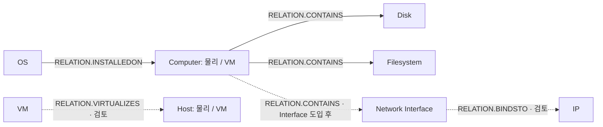

# Computer 중심 CI 관계 설계

> 2026-09-15 조사 결과에 따른 구현 제안. 관계 코드·분류쌍은 재조회했으며 관계 적재 코드는 변경하지 않았다.
> 원천 근거: [D42 관계 원천](../../knowledge/device42/computer-ci-relations.md).
> 타겟 근거: [Maximo 관계 정의](../../knowledge/maximo/computer-ci-relations.md).
> 미결 정본: [ISSUE-11](../../open-issues.md#issue-11-actual-ci-분류속성관계와-식별자-매핑).

## 먼저 구현할 관계

| 규칙 이름 제안 | 저장 방향 | 정확한 relationnum | 판정 |
| --- | --- | --- | --- |
| COMPUTER_CONTAINS_DISK | Computer → Disk | RELATION.CONTAINS | 원천·분류쌍 확인. 구현 가능 |
| COMPUTER_CONTAINS_FILESYSTEM | Computer → Filesystem | RELATION.CONTAINS | 원천·분류쌍 확인. 구현 가능 |
| OS_INSTALLED_ON_COMPUTER | OS → Computer | RELATION.INSTALLEDON | 물리 Computer 단건 INSERT·SWAPPED=0·승격·표시 확인. 자동 저장 구현·가상 Computer 검증은 별도 |
| VM_VIRTUALIZES_HOST | VM → Host Computer | RELATION.VIRTUALIZES | 후보. 1:1 설정·SWAPPED·표시 검증 전 보류 |
| COMPUTER_CONTAINS_INTERFACE | Computer → Interface | RELATION.CONTAINS | Interface CI 미구현. 별도 유형 도입 후 |
| INTERFACE_BINDS_IP | Interface → IP | RELATION.BINDSTO | Interface 도입·카디널리티·미연결 IP 처리 검토 후 |
| COMPUTER_IP 직접 연결 | 미선정 | 미선정 | 명시 규칙 없음. 기존 코드의 이름만 빌려 연결하지 않음 |

Computer는 물리·가상 두 분류를 허용한다. 표의 구현 가능은 소스/타겟 매핑이 갖춰졌다는 뜻이며,
운영 적재·화면·승격 검증을 완료했다는 뜻은 아니다.
OS → 물리 Computer의 단건 결과는 [검증 기록](../../knowledge/maximo/computer-ci-relations.md#oscomputer-승격-샘플-검증)을 참조한다.
OS는 설치 사실을 매핑한다. device 연결만으로 실행 상태까지 확인한 것으로 보고 RUNSON을 함께 만들지 않는다.

## 관계도 — 화살표는 저장 방향



실선은 우선 구현 매핑, 점선은 보류·확장 후보다.
VM→Host는 규칙의 저장 방향이며, 사용자 화면에 어떤 문장/방향으로 보일지는 별도 검증한다.
표시할 관계의 선택은 수집·저장 규칙과 분리하고 이번 조사에서 UI 설정은 바꾸지 않는다.

## 실행 위치 — CI 본체 적재 이후 별도 단계

관계는 본체 task 안에서 저장하지 않는다. 모든 본체·스펙 task가 끝난 뒤 관계 단계를 실행한다.

```text
CiIntegrationJob
  1. 분류·속성 기준정보 조회
  2. CI 본체·스펙 task 실행      Computer · OS · Disk · Filesystem · IP
  3. 관계 단계 실행
  4. 처리 결과 집계
```

분리하는 이유:

- 관계의 실행 위치·실패 처리·재실행 방식을 하나로 통일하고, 관계만 독립 재실행할 수 있다.
- 상대 CI가 뒤쪽 배치에 있어 누락되는 경우를 구조적으로 없앤다. 본체 task 안에서 저장하면
  Computer를 먼저 실행하도록 명시적 순서를 걸어야 하고, VM→Host처럼 같은 유형 안의
  선후 관계는 그 순서로도 해결되지 않는다.
- 본체용 중복 제거와 관계의 연결 보존을 분리한다. 본체가 이미 축약한 결과를 관계에
  재사용하는 실수를 만들지 않는다.

관계 단계가 시작됐다는 것이 본체 적재의 성공을 뜻하지는 않는다.
저장 전제는 아래 「저장 전제와 이번 조사 한계」를 따른다.

## 구조 추천안 — 도메인별 조회 정의 + 공통 실행기

> 추천안이다. 클래스 이름·정의 등록 방식은 구현 시 확정한다.

관계마다 `OsComputerRelationIntegrate` 같은 클래스를 두면 관계 수만큼 클래스가 늘어난다.
관계 조회는 대부분 SELECT 하나와 키 변환이라 클래스로 나눌 상태·분기가 없다.
조회 정의를 데이터로 두고 실행기 하나가 조회·변환·저장·집계를 맡는 안을 우선한다.

```text
관계 단계
  CiRelationIntegrate          이름 제안. 조회 → 변환 → 저장 → 집계
    ├─ OS 관계 조회 정의
    ├─ Disk 관계 조회 정의
    ├─ Filesystem 관계 조회 정의
    └─ Computer 관계 조회 정의    검증된 관계만 활성화
    ↓
  ActCiRelationWriter          공통 MERGE
```

여러 API 조합이나 별도 상태·판정이 필요한 도메인이 실제로 등장하면 그 도메인만
전용 Collector로 분리한다. SQL로 처리되는 관계를 위해 미리 클래스를 만들지 않는다.

## 조회 정의의 소유 기준

관계의 출발점이 아니라 **연결 근거를 제공하는 원천 도메인**으로 묶는다.

| 원천 도메인 | 관계 | 연결 근거 |
| --- | --- | --- |
| OS | OS → Computer | deviceos_pk · device_fk |
| Disk | Computer → Disk | Hard Disk 조건의 part_pk · device_fk |
| Filesystem | Computer → Filesystem | mountpoint_pk · device_fks |
| Computer | VM → Host | device_pk · virtual_host_device_fk |
| IP | Interface → IP | ipaddress_pk · netport_fk |

Computer → Disk도 Disk 도메인 정의가 소유한다. Computer가 등장하는 관계를 Computer에 모으지 않는다.
이는 구현상 조회 책임 기준이다. 문서 정본은 기존 규약대로 출발 유형 문서가 소유하므로
코드 소유와 문서 소유가 갈리는 관계가 있다. SQL을 양쪽에 복사하지 않고 링크로 잇는다.

## 관계 조회의 계약

- 본체와 같은 수집 범위·필터를 적용한다.
- 관계 생성에 필요한 연결 키만 조회한다. 본체 속성은 다시 읽지 않는다.
- 전체 ACTCI를 메모리에 올려 이름으로 찾지 않는다. 양 끝은 원천의 확인된 연결 키로 만든다.
- 본체 task가 관계 후보를 누적해 다음 단계로 넘기는 방식보다, 관계 단계가 원천의 연결 키만
  다시 읽는 안을 우선한다. 보관 규모·수명 관리가 필요 없고 관계만 재실행할 수 있다.

공통 Writer에 넘기는 값은 출발 ACTCINUM, 도착 ACTCINUM, 정확한 relationnum 셋뿐이다.
예상 분류는 넘기지 않는다. 근거는 [공통 매핑 3절](../../data-mapping/ci/actcirelation.md#3-공통-저장-sql-제안)에 있다.
SQL의 저장 위치·Java 타입·정의 등록 방식은 구현 시 정한다.
문서화를 위해 범용 플러그인 구조나 설정 체계를 미리 설계하지 않는다.

## 본체 중복 제거와 관계 보존

- 본체는 원천 개체 PK마다 하나. 관계는 (SOURCECI,TARGETCI,RELATIONNUM)마다 하나.
- IP·Filesystem의 device_fks는 단일 장비로 축약하지 않는다.
- 기존 DISTINCT ON은 본체 적재에 유지한다. 관계 단계는 본체 조회를 재사용하지 않고
  연결 쌍을 전용 SELECT로 다시 읽으므로 배열이 축약되지 않는다.
  마운트포인트 10에 device_fks={173,174}이면 관계는 두 행이다.
- 관계 조회에서 제거하는 중복은 최종 관계 키 (SOURCECI,TARGETCI,RELATIONNUM)가 같은 경우뿐이다.
- IP 관계는 원천에서 netport_fk와 장비 배열을 읽어야 한다. 본체 DTO에는 없다.
  Interface 도입 시 관계 조회 정의에서 확보한다.
- netport_fk가 없는 IP를 같은 장비의 임의 포트에 연결하지 않는다.

## 관계 정의의 코드 표현

`enums.ci.CiRelationRule`에 업무상 관계 규칙을 명시하는 안이다.
카테고리 두 개만으로 관계를 자동 결정하지 않는다. 같은 두 유형에도 다른 의미의 관계가 존재한다.

각 규칙이 가질 값은 **정확한 relationnum과 원천에서 정한 기본 저장 방향**이다.
예: COMPUTER_CONTAINS_DISK는 Computer → Disk 방향, relationnum=RELATION.CONTAINS.

허용 분류 집합은 enum에 넣지 않는다. 분류 검사는 MERGE가 실제 ACTCI 행과
RELATIONRULES로 하므로 코드가 같은 목록을 이중으로 들고 있을 이유가 없다.
전체 RELATIONRULES를 전역 캐시하거나 숫자 ID를 enum에 넣을 필요도 없다.
CARDINALITY·CONTAINMENT·REVRELATIONSHIP은 DB 정의를 확인하며 enum에 별도 정본을 만들지 않는다.

DTO 제안: sourceCiNum, targetCiNum, rule. SWAPPED는 규칙 메타데이터의 단순 복사 값이 아니다.
원천 조회 SQL은 각 도메인 조회 정의가, 관계 MERGE SQL은 공통 Writer가 소유한다.

## 저장 전제와 이번 조사 한계

[ACTCIRELATION 공통 매핑](../../data-mapping/ci/actcirelation.md)의 고유키와 가드를 사용한다.
양 끝 ACTCI가 실제로 있는지, 그 둘의 실제 분류쌍에 해당 관계 규칙이 있는지 확인한다.
기존 행이 있다는 것은 **이번 실행에서 본체 갱신에 성공했다는 뜻은 아니다**.
현재 ActCiWriter는 성공 건수만 반환하므로 이번 실행 성공 CI만 연결하려면 결과 계약을 추가해야 한다.
현재 최소안은 저장된 본체의 존재와 규칙을 검사하는 것으로, 갱신 성공 여부 검증과 구분한다.

관계가 0건 처리됐다고 항상 오류는 아니다. 양 끝 미존재나 규칙 미등록을 나타낼 수 있다.
원인을 구분하려면 실패 건만 추가 조회하거나 사전 캐시와 비교한다.
관계 삭제·재부착 시 이전 관계 정리·원천 스냅샷 일관성·동시 실행 정책은 이번에 확정하지 않는다.
따라서 MERGE만 구현한 상태를 이동·삭제까지 현행화되는 기능이라고 설명하지 않는다.

## 보류 근거

- VM–Host: 원천은 명확하나 복수 VM이 같은 호스트를 참조하는 데이터와 규칙 1:1을 검증해야 한다.
- IP: 직접 규칙이 없다는 것이 물리 저장 불가를 뜻하지는 않는다. 새 규칙 추가 또는 Interface 도입은
  수집 모델 선택이며 이번에 임의 결정하지 않는다. Interface 경로만으로 공유 IP의 모든 장비 연결이 복구되지 않는다.
- OS–Filesystem: BOOTSFROM 규칙은 있지만 같은 장비라는 정보만으로 부팅 파일시스템을 특정할 수 없다.
- Disk–Filesystem: 확인한 두 원천 사이에 직접 FK가 없으며, 중간 볼륨 계층을 추정하지 않는다.
- VM 관리 장비·섀시·Computer 네트워크 연결: 원천 역할/표본과 대상 분류 규칙이 부족하다.
- CPU: 현재 독립 CPU CI 구현이 없다. 규칙은 존재하지만 DPA CPU 적재를 CI 존재로 취급하지 않는다.
