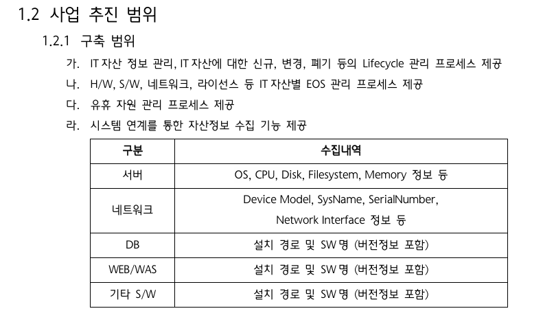

# 사업 추진 범위

> 출처: 사용자가 2026-09-11 제공한 사업 문서 발췌 이미지의 「1.2 사업 추진 범위 / 1.2.1 구축 범위」.
> 원본 문서명·버전·작성일은 제공되지 않았다. 아래는 제공된 발췌 범위의 전사이며 전체 사업 문서를 대신하지 않는다.
> 사용자는 이 범위를 프로젝트의 조사·설계 기준으로 삼도록 지정했다.

## 구축 범위 — 제공 원문

가. IT자산 정보 관리, IT자산에 대한 신규, 변경, 폐기 등의 Lifecycle 관리 프로세스 제공

나. H/W, S/W, 네트워크, 라이선스 등 IT자산별 EOS 관리 프로세스 제공

다. 유휴 자원 관리 프로세스 제공

라. 시스템 연계를 통한 자산정보 수집 기능 제공

| 구분 | 수집내역 |
| --- | --- |
| 서버 | OS, CPU, Disk, Filesystem, Memory 정보 등 |
| 네트워크 | Device Model, SysName, SerialNumber, Network Interface 정보 등 |
| DB | 설치 경로 및 SW명 (버전정보 포함) |
| WEB/WAS | 설치 경로 및 SW명 (버전정보 포함) |
| 기타 S/W | 설치 경로 및 SW명 (버전정보 포함) |

## 이 저장소에서 참조하는 방법

- 사업 전체의 관리 프로세스와 시스템 연계 수집 범위를 구분한다. 이 저장소는 Device42 → Maximo 데이터 연계 배치이며, 위 관리 프로세스 전체의 구현 완료를 뜻하지 않는다.
- 수집 요구사항은 위 다섯 구분을 기준으로 추적한다. D42 뷰·필드, Maximo 적재 대상, 검증 결과는 기존 [데이터 매핑 문서](../data-analysis/data-mapping/README.md)에 작성한다.
- 제공된 표에는 CI 분류·속성·관계 코드 및 개별 수집 항목을 독립 CI로 만들지 여부가 명시되어 있지 않다.
- DB 행에 명시된 수집내역은 설치 경로·SW명·버전이다. 개별 Database·Schema 수집은 명시되어 있지 않다.
- Kubernetes는 별도 구분으로 명시되어 있지 않다. 원문의 “등”을 포함하여, 명시되지 않은 항목의 포함·제외는 이 발췌만으로 확정하지 않는다.
- CI 관리 단위·관계와 기존 조사 범위의 조정은 [ISSUE-8](../data-analysis/open-issues.md#issue-8-actual-ci-대상-범위), 분류·속성·식별자 정책은 같은 문서의 ISSUE-11에서 관리한다.

## 제공 이미지

